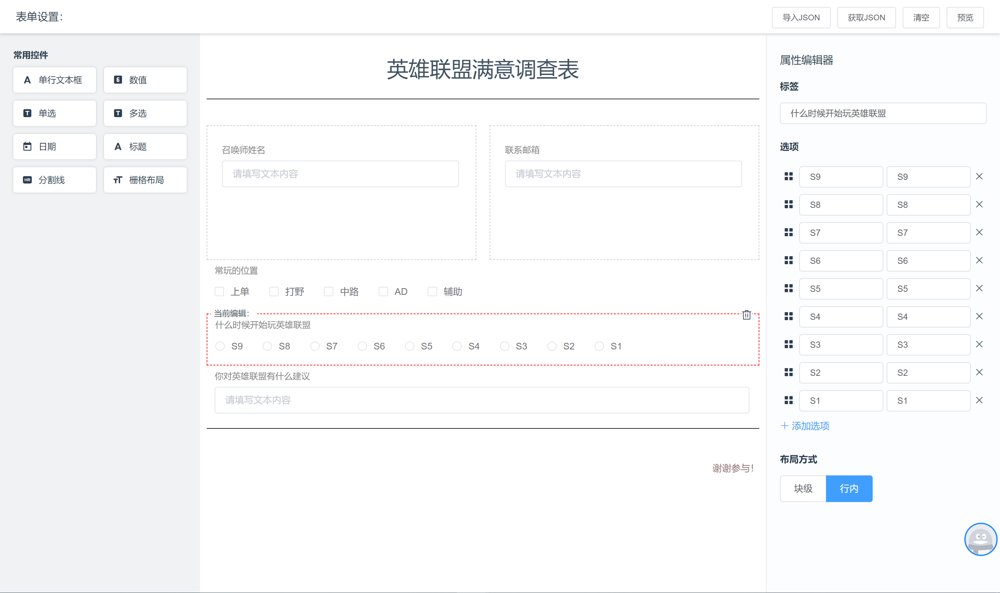
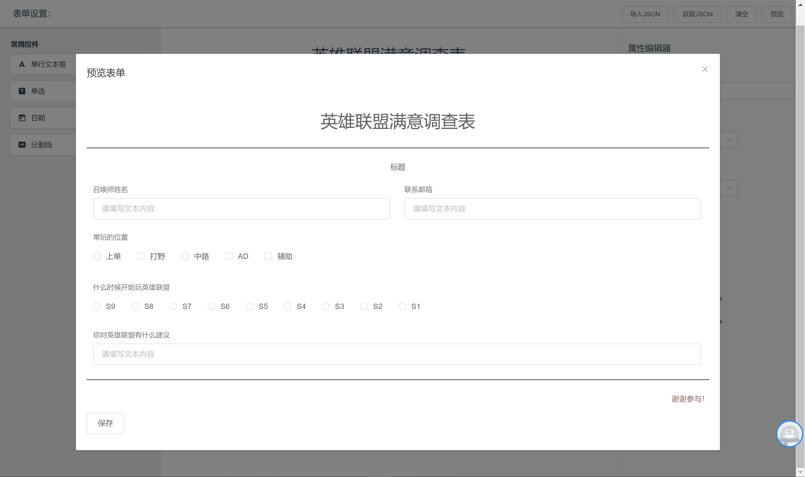

# belvoly-form-studio

动态表单创建和渲染的组件， 基于 `Vue` 和 `Typescript`，UI 采用了 `element-ui`。

## 组件
两大组件 `Design` 和 `Viewer`。

### Design 组件
> 设计器组件，此组件提供拖拽方式完成表单的设计，并返回设计器的JSON Model。

```javascript
import { Design } from 'belvoly-form-studio'

export default {
    method: {
        get () {
            // 获取设计器的JSON Model
            const designModel = this.$refs.designer.getModel()
        }
    }
}
```
```html
<design :defaultModel="defaultDesignModel" ref="designer"></design>
```
#### 属性
- `defaultModel`：在设计器打开时默认设计数据，默认为null即可。此属性用在编辑时，或导入json时使用.
#### 方法  
- `getModel`：获取设计器的JSON Model
- `clear`: 清空设计器


效果


### Viewer 组件
> 此组件将Design组件的JSON Model 转为表单界面，支持数据获取，数据校验

```javascript
import { Viewer } from 'belvoly-form-studio'
```
```html
<viewer :designModel="designModel"></viewer>
```
#### 属性
- `defaultModel`：设计器生成的模型数据，Viewer根据此模型数据渲染表单.
- `defaultValue`：表单默认的数据，第一次有用。
- `itemValueField`：表单元素根据控件属性的哪个字段获取值，默认 'id'。
- `mobile`：是否渲染为移动表单，默认 `false`。
#### 方法
- `validate`：验证所有控件。
- `getData`：获取表单的数据

效果


## v 0.2.13
1. Design组件增加`isPreventOnFilter`属性, boolean类型，在filter事件的时候，是否阻止默认事件，参见`sortablejs`设置

## v 0.2.12
1. FormDesign组件的属性和验证属性组件都支持extra获取
2. 控件的icon现在和样式名一样
3. 调整FormDesign组件的样式名统一

## v 0.2.11
1. Guid组件重命名为Grid
2. Grid组件增加gutter属性，栅格之间的间距
3. 增加内部组件DesignZone、ViewZone导出
4. DesignZone 增加 `replaceControl`、`beforeControl`、`afterControl`方法
5. IProperty 增加`tag`属性

## v 0.2.10
1. FormDesign、Design、Viewer组件增加extra属性，用于向子组件提供额外数据，子组件通过extra属性获取。extra必须是json格式。不是必须的

## v 0.2.9
1. Vue.install选项增加isUseDefaultControls选项，是否启用默认的控件，默认true
2. Vue.install选项增加isRegisterComponent选项，是否注册全局Vue组件，默认false，`bfs-design`、`bfs-form-design`、`bfs-viewer`

## v 0.2.8
1. 增加属性验证为必填时，显示红色的*号
2. 修复属性过多超出部分没有显示，增加滚动条

## v 0.2.7
1. 增加FormDesign组件属性验证功能，通过enablePropertyValid属性控制，默认为false。当为true时，属性如果不通过，再添加或切换其它组件会提示信息
2. 增加FormDesign组件itemAdd事件
3. 增加FormDesign组件validate方法，验证属性是否通过
4. 移除属性编辑器字样，改为当前组件：

## v 0.2.6
1. 修复FormDesign组件在defaultModel有值，再拖拽新的控件，可能遇见key重复报错

## v 0.2.5
1. 修复Guid控件没有支持readonly